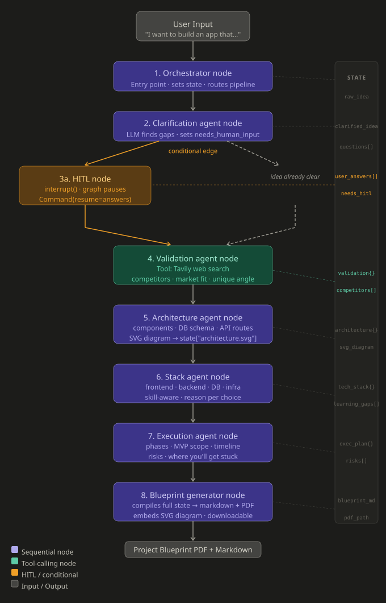

# Blueprint Agent

A LangGraph-powered agentic pipeline that turns a vague project idea into a structured, downloadable project blueprint PDF.

Describe your idea in plain English — the pipeline validates it, designs the architecture, recommends a tech stack, and generates a complete build plan.

---

## How It Works

The pipeline runs through 8 nodes in a LangGraph state graph:

1. **Orchestrator** — initializes state, sets up the pipeline
2. **Clarification Agent** — LLM analyzes the idea and detects missing information
3. **HITL Node** — if gaps are found, graph pauses via `interrupt()` and waits for user answers before resuming
4. **Validation Agent** — uses Tavily web search to check market fit, competitors, and unique angle
5. **Architecture Agent** — designs system components, DB schema, API routes, generates SVG diagram
6. **Stack Agent** — recommends frontend, backend, DB, and infra based on your skill level
7. **Execution Agent** — builds a phase-wise MVP plan with timeline and risk areas
8. **Blueprint Generator** — compiles full state into markdown and exports as a downloadable PDF

---

## Tech Stack

- **LangGraph** — stateful graph execution with conditional routing and HITL interrupts
- **Groq (LLaMA 3.1)** — LLM inference for all agent nodes
- **Tavily** — web search tool for market validation
- **FastAPI** — backend API with `/generate` and `/resume` endpoints
- **Render** — backend deployment
- **GitHub Pages** — frontend hosting

---

## Features

- Conditional routing — skips HITL if the idea is already clear
- Human-in-the-loop — graph pauses mid-execution and resumes after user input
- Skill-aware recommendations — stack and plan adapt to beginner / intermediate / advanced
- Downloadable PDF output with embedded architecture diagram

---

## Run Locally

```bash
git clone https://github.com/Mohit-Baraiya11/Blueprint-agent
cd Blueprint-agent
uv sync
uv run uvicorn main:app --reload
```

Then open `index.html` in your browser.

---

## Live Demo

- Frontend: [mohit-baraiya11.github.io/Blueprint-agent](https://mohit-baraiya11.github.io/Blueprint-agent)
- Backend: [blueprint-agent-3.onrender.com](https://blueprint-agent-3.onrender.com)

> Note: Backend is on Render free tier — first request may take 50+ seconds to cold start.

---

## Architecture



---

Built by [Mohit Baraiya](https://github.com/Mohit-Baraiya11)
